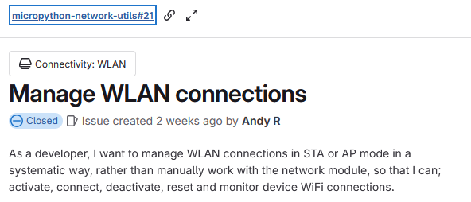
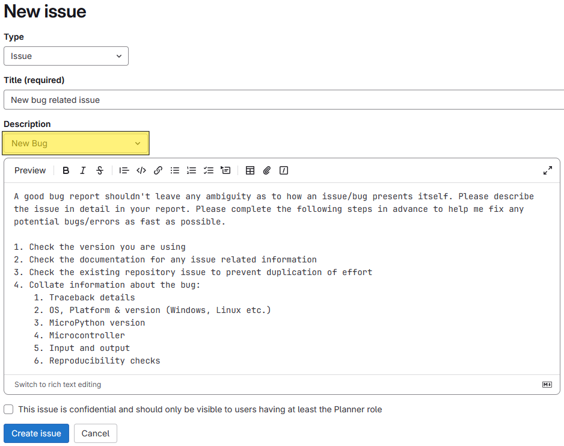

# Contribution Guidelines

Contributions are welcome and these should ideally be made through the main repository on [GitLab](https://gitlab.com/micropython-iot-projects/libraries/micropython-network-utils).

## Local Development

This package facilitates MicroPython development in VSCode through the settings in `.vscode` and the [`micropython-stdlib-stubs`](https://github.com/Josverl/micropython-stubs) project dev dependency. Type hints on MicroPython code are enabled through the following files, which are included as a package dependency and installed to the device `lib/` directory:

* `typing`: [micropython-stubs](https://raw.githubusercontent.com/Josverl/micropython-stubs/refs/heads/main/mip/typing.py)
* `typing_extensions`: [micropython-stubs](https://raw.githubusercontent.com/Josverl/micropython-stubs/refs/heads/main/mip/typing_extensions.py)

## New Issues; Bugs & Features

### Features

Choose a suitable title and use a story format that explains the feature in depth:

```txt
As a [developer | user | system], instead of [current situation], I want [action | feature], so that [value | justification].
```

Issue description templates can help provide a useful format and context:


Full example:



### Bugs

Use the `New Bug` description template when creating issues related to bugs:



## Cloning The Repository

This repository is managed by Astral [`uv`](https://docs.astral.sh/uv/) Python package manager and can be installed by cloning the repository and syncing with uv.

```sh
git clone git@gitlab.com:micropython-iot-projects/libraries/micropython-network-utils.git
cd micropython-network-utils
uv sync --all-extras
```

Activate the virtual environment created by uv:

```sh
source .venv/bin/activate
```

## Linting & Formatting

With the virtual environment activated, the `ruff` check & format commands will implement the rules set in the pyproject.toml file. These tool can be also be run using the commands `uv run ruff check` or `uv run ruff format`.

To format the code in accordance with the project formatting rules, use the following command:

```sh
ruff format
```

To run the ruff linting tool, use the following command:

```sh
ruff check --fix
```

### Commit Messages

Commit messages use the [conventional commits](https://www.conventionalcommits.org/en/v1.0.0/#summary) specification:

`<type>[optional scope]: <description>`

```sh
git commit -m "docs: update contribution guidelines."
git commit -m "chore: ruff lint & format."
git commit -m "feat: add new mqtt extension package module."
git commit -m "fix: patch an installation error for cli install command #1234."
```

A breaking change is indicated with a '!':

```sh
git commit -m "refactor!: drop support for rshell."
```
