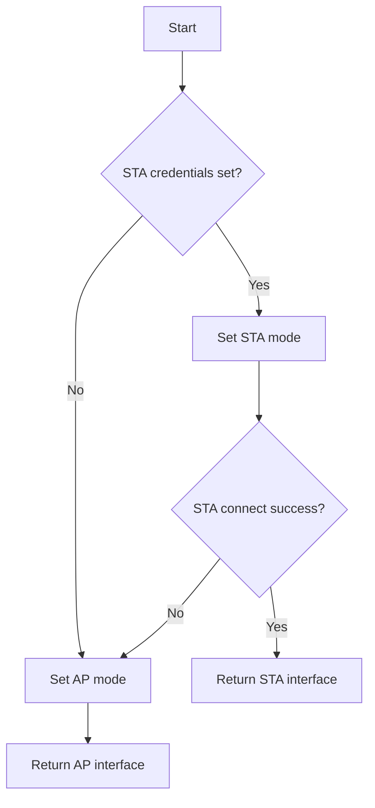

# MicroPython Package Repository - `networkutils`

NOTE: The main repo is @ [GitLab](https://gitlab.com/micropython-iot-projects/libraries/micropython-networkutils) and is mirrored @ [GitHub](https://github.com/andyrids/micropython-networkutils).

This is a repository for a MicroPython package named `networkutils`, which contains utility functions related to interfaces exposed by the [`network`](https://docs.micropython.org/en/latest/library/network.html#module-network) standard library and external packages on the [`micropython-lib`](https://github.com/micropython/micropython-lib) repository.

1. Uses network environment variable class for credential configuration in client (STA) & access point (AP) modes.
2. Attempts WiFi connection in STA mode; if unsuccessful, resets interface to AP with default or environment-provided credentials.
3. Provides helper functions for activating, deactivating, connecting interfaces and checking connection status.
4. Implements timeouts for network operations to handle hardware-specific quirks



This package facilitates MicroPython development in VSCode through the settings in `.vscode` and the [`micropython-stdlib-stubs`](https://github.com/Josverl/micropython-stubs) project dependency. Type hints on MicroPython code are enabled through the following files, which are included as a package dependency and installed to the device `lib/` directory:

* `typing`: [micropython-stubs](https://raw.githubusercontent.com/Josverl/micropython-stubs/refs/heads/main/mip/typing.py)
* `typing_extensions`: [micropython-stubs](https://raw.githubusercontent.com/Josverl/micropython-stubs/refs/heads/main/mip/typing_extensions.py)

In a MicroPython context, This package follows the ***extension package*** concept outlined in the [micropython-lib](https://github.com/micropython/micropython-lib) repository. Extension packages will extend the functionality of the `networkutils` package, by adding additional files to the same package directory. These packages will follow the naming convention `networkutils-*` and will install extra modules to the directory `lib/networkutils` on the device.

e.g. `networkutils` would install the `core.py` file on the device as `lib/networkutils/core.py` and the `networkutils-mqtt` extension package would install `mqtt.py` as `lib/networkutils/mqtt.py`.

Installation of `networkutils` will only install files that are part of the `networkutils` package, whereas installation of `networkutils-mqtt` will install the package extension files along with the `networkutils` package it extends.

```text
micropython-networkutils
├── networkutils           <-- Core `networkutils` package
│   ├── manifest.py
│   ├── networkutils       <-- Device installation dir i.e. `lib/networkutils/`
│   │   └── core.py        <-- Core package module
│   └── package.json       <-- Package URLs & dependencies (for `mip install`)
├── networkutils-mqtt      <-- Extension package for `networkutils`
│   ├── manifest.py
│   ├── networkutils       <-- Device installation dir i.e. `lib/networkutils/`
│   │   └── mqtt.py        <-- Extension package module
│   └── package.json       <-- Extension package URLs & dependencies (includes core `networkutils`)
```

## Cloning The Repository

This repository is managed by Astral [`uv`](https://docs.astral.sh/uv/) Python package manager and can be installed by cloning the repository and syncing with uv.

```sh
git clone git@gitlab.com:micropython-iot-projects/libraries/micropython-network-utils.git
cd micropython-network-utils
uv sync
```

## MicroPython Package Installation

The following commands will install the `network-utils` package based on the URLs and dependencies listed in the `network-utils/package.json`.

Note that because we have repositories within sub-groups, the usual installation URLs such as `gitlab:org/repo-name@main` or `gitlab:org/repo-name/dir/__init__.py` will not work. The `mip` package installer always assumes that the first URL component is the org and the second is the repository slug, resulting incorrect parsed URLs for package download/installation (for these nested repositories). This issue is mitigated by using raw URLs in the `package.json` files and you can use the installation URLs for the GitHub mirror repo i.e. github:andyrids/micropython-network-utils/network-utils/.

You can format and reset your device with `mpremote` using the following command:

```sh
mpremote exec --no-follow "import os, machine, rp2; os.umount('/'); bdev = rp2.Flash(); os.VfsLfs2.mkfs(bdev, progsize=256); vfs = os.VfsLfs2(bdev, progsize=256); os.mount(vfs, '/'); machine.reset()"
```

### mpremote

The following commands will install the `network-utils` package on your device using the `mpremote` Python package. Note that the `package.json` is optional as `mip` will add it, if the URL ends without a `.mpy`, `.py` or `.json` extension.

```sh
mpremote mip install https://gitlab.com/micropython-iot-projects/libraries/micropython-network-utils/-/raw/HEAD/network-utils/package.json
```

The following command will install the package using the mirrored repository on GitHub:

```sh
mpremote mip install github:andyrids/micropython-network-utils/network-utils/
```

### REPL

The following code will import `mip` and install the `network-utils` package from the REPL, provided you have a connected and network-capable board.

```python
>>> import mip
>>> mip.install("https://gitlab.com/micropython-iot-projects/libraries/micropython-network-utils/-/raw/HEAD/network-utils/package.json")
```

GitHub mirrored repository alternate installation:

```python
>>> import mip
>>> mip.install("github:andyrids/micropython-network-utils/network-utils/")
```

## Example Usage

Environment variables relevant to network configuration, can be set and retrieved using the `network_utils.NetworkEnv` singleton class.

Environment variables:

* `WLAN_SSID` - Network SSID (STA mode)
* `WLAN_PASSWORD` - Network password (STA mode)
* `AP_SSID` - Your device network SSID (AP mode)
* `AP_PASSWORD` - Your device network password (AP mode)

```python
from network_utils import (
    NetworkEnv, connection_issue, get_network_interface, _logger
)

env = NetworkEnv()
env.putenv("WLAN_SSID", "your SSID")
env.putenv("WLAN_PASSWORD", "your PASSWORD")

# set `debug` parameter to `True` for verbose debug messages
WLAN, WLAN_MODE = get_network_interface(debug=True)

if not connection_issue(WLAN, WLAN_MODE):
    _logger.debug("STA CONNECTION ESTABLISHED")
else:
    _logger.debug("CONNECTION ERROR, WLAN IN AP MODE")
```

If successfully connected to a WiFi in STA mode, you should see output like the following:

```sh
DEBUG:network_utils:INITIALISE NETWORK WLAN INSTANCE
DEBUG:network_utils:SETTING WLAN MODE TO STA
DEBUG:network_utils:ACTIVATE NETWORK INTERFACE
DEBUG:network_utils:NETWORK INTERFACE ACTIVE - AP MODE
DEBUG:network_utils:CONNECTING TO SSID 'S23'
DEBUG:network_utils:WAITING FOR WLAN CONNECTION
DEBUG:network_utils:WLAN STATUS: 1
DEBUG:network_utils:WLAN STATUS: 1
DEBUG:network_utils:WLAN STATUS: 1
DEBUG:network_utils:WLAN STATUS: 2
DEBUG:network_utils:WLAN STATUS: 2
DEBUG:network_utils:WLAN STATUS: 3
DEBUG:network_utils:WLAN CONNECTION SUCCESSFUL: S23
DEBUG:network_utils:STA CONNECTION ESTABLISHED
```

If there was a connection error or if no configuration variables were set, the device should start in AP mode with output like the following:

```sh
DEBUG:network_utils:INITIALISE NETWORK WLAN INSTANCE
DEBUG:network_utils:INVALID SSID (None) SETTING AP MODE
DEBUG:network_utils:ACTIVATE NETWORK INTERFACE
DEBUG:network_utils:NETWORK INTERFACE ACTIVE - AP MODE
```

You should see your device AP listed as something like `DEVICE-E66164084373532B` in your available networks on your PC or mobile.
