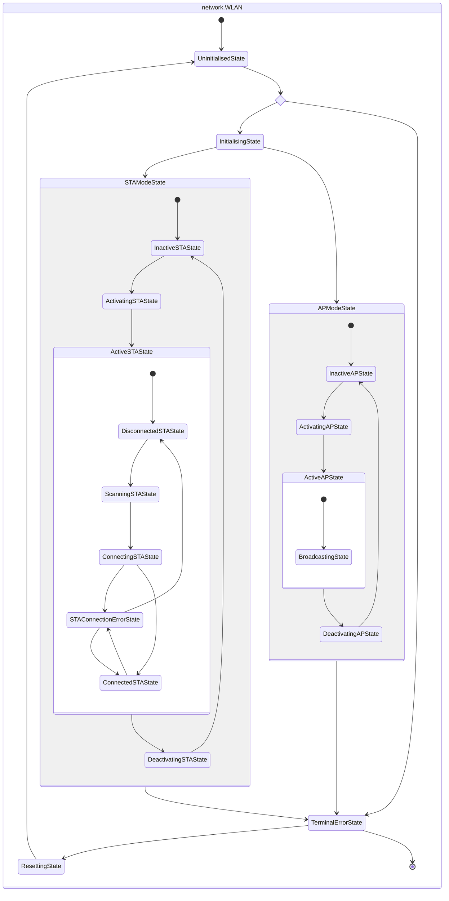

# MicroPython Package - `networkutils`

The `networkutils` MicroPython package provides utility functions related to the [`network`](https://docs.micropython.org/en/latest/library/network.html#module-network) standard library package, which manage connections through the `network.WLAN` interface.

> [!NOTE]
> The main repo is @ [GitLab](https://gitlab.com/micropython-iot-projects/libraries/micropython-networkutils) and is mirrored @ [GitHub](https://github.com/andyrids/micropython-networkutils).

## Key Features

* Uses network environment variable class for credential configuration in client (STA) & access point (AP) modes.
* Uses asynchronous programming with [`asyncio`](https://github.com/peterhinch/micropython-async/blob/master/v3/docs/TUTORIAL.md).
* Provides functions for managing WLAN interface setup & connections.
* Provides a hierarchical finite state machine (HFSM) to manage interface & connections.



## Repository Layout

```text
micropython-networkutils
├── networkutils           <-- Device installation dir i.e. `lib/networkutils/`
│   ├── __init__.py 
│   └── core.py            <-- Core package module
│
├── scripts                <-- Project scripts
│   ├── build
│   │   ├── compile.py     <-- Hatch build hook for compilation with `mpy-cross` (WIP)
│   │   └── __init__.py
│   └── __init__.py
│
├── tests                  <-- Pytest Unit & integration tests
│   ├── conftest.py        <-- Pytest fixtures
│   ├── __init__.py
│   ├── integration
│   │   ├── __init__.py
│   │   └── test_connection_and_package.py
│   └── unit
│       ├── __init__.py
│       ├── test_network_config.py
│       ├── test_network_interface_complete.py
│       └── test_network_interface_complex.py
│       
├── examples               <-- Examples using networkutils
│   ├── ap_hfsm.py
│   ├── ap_mode.py
│   └── sta_mode.py
│
├── package.json           <-- Package URLs & dependencies (for `mip install`)
├── pyproject.toml         <-- Root `pyproject.toml` enables local package setup/installation
├── CHANGELOG.md           <-- Notable changes to this project
├── CONTRIBUTION.md        <-- Local development & contribution guidance
├── LICENCE.md             <-- Licence information
└── TESTING.md             <-- Unit & integration testing guidance
```

## Cloning The Repository

This repository is managed by Astral [`uv`](https://docs.astral.sh/uv/) Python package manager and can be installed by cloning the repository and syncing with uv.

```sh
git clone git@gitlab.com:micropython-iot-projects/libraries/micropython-networkutils.git
cd micropython-networkutils
uv sync --all-extras
```

You can also clone from the GitHub mirror repo:

```sh
git clone git@github.com:andyrids/micropython-networkutils.git
cd micropython-networkutils
uv sync --all-extras
```

> [!IMPORTANT]
> The `--all-extras` option for the `uv sync` command enables extension package installation and will be necessary for any unit tests or local development that needs them.

Activate the virtual environment created by uv.

```sh
. .venv/bin/activate
```

## MicroPython Package Installation

The following commands will install the `networkutils` package based on the URLs and dependencies listed in the `package.json`.

As we have repositories within sub-groups (on GitLab), the usual installation URLs such as `gitlab:org/repo-name@main` or `gitlab:org/repo-name/dir/__init__.py` will not work. The `mip` package installer always assumes that the first URL component is the org and the second is the repository slug, resulting incorrect parsed URLs for package download/installation. This issue is mitigated by using raw URLs in the `package.json` and using the GitHub mirror repo i.e. github:andyrids/micropython-network-utils/networkutils/.

You can format and reset your device with `mpremote` using the following command:

```sh
mpremote exec --no-follow "import os, machine, rp2; os.umount('/'); bdev = rp2.Flash(); os.VfsLfs2.mkfs(bdev, progsize=256); vfs = os.VfsLfs2(bdev, progsize=256); os.mount(vfs, '/'); machine.reset()"
```

### `mpremote`

The following commands will install `networkutils` on your device using the `mpremote` Python package. Note that the `package.json` is optional as `mip` will add it, if the URL ends without a `.mpy`, `.py` or `.json` extension.

```sh
mpremote mip install github:andyrids/micropython-networkutils/
```

## Example Usage

Environment variables relevant to network configuration, can be set and retrieved using the `networkutils.NetworkEnv` singleton class.

Environment variables:

* `NetworkEnv.WLAN_SSID` ('WLAN_SSID') - Network SSID (STA mode)
* `NetworkEnv.WLAN_PASSWORD` ('WLAN_PASSWORD') - Network password (STA mode)
* `NetworkEnv.AP_SSID` ('AP_SSID') - Your device network SSID (AP mode)
* `NetworkEnv.AP_PASSWORD` ('AP_PASSWORD') - Your device network password (AP mode)

```python
import asyncio
import logging
import network
from networkutils import (
    NetworkEnv,
    activate_interface,
    connect_interface,
    get_network_interface,
)
from networkutils.core import (
    WLANConnectionError,
    WLANCredentialsError,
    WLANNotFoundError,
    _logger,
)


async def main() -> None:
    """Initialises, activates & connects a WLAN to an access point."""
    # get initialised WLAN interface in STA mode & activate
    WLAN = get_network_interface(mode=network.STA_IF)
    await activate_interface(WLAN)

    try:
        # attempt connection to access point
        await connect_interface(WLAN)
    except WLANConnectionError:
        _logger.error("Failed connection to access point")
    except WLANCredentialsError:
        _logger.error("Incorrect credentials for access point")
    except WLANNotFoundError:
        _logger.error("Access point not found in available networks")

    if WLAN.isconnected():
        _logger.info("Connected to access point")

    while True:
        await asyncio.sleep(1)


try:
    # set logging level for verbose debug messages
    _logger.setLevel(logging.DEBUG)

    # set environment variables
    env = NetworkEnv()
    env.putenv(NetworkEnv.WLAN_SSID, "<YOUR_SSID>")
    env.putenv(NetworkEnv.WLAN_PASSWORD, "<YOUR_PASSWORD>")

    _logger.info("Executing `main` coroutine")
    asyncio.run(main())
except KeyboardInterrupt:
    _logger.error("Caught `KeyboardInterrupt`")
finally:
    _logger.info("Cleaning asyncio `AbstractEventLoop`")
    # clean up asyncio `AbstractEventLoop`
    asyncio.get_event_loop().close()
    asyncio.new_event_loop()
```

After cloning the repository, syncing the pyproject.toml with uv and installing `networkutils` on your device, you can also run the examples with `mpremote`.

```sh
mpremote run examples/access_point.py 
```

To stop running the app and clear the event loop, connect to the device with `mpremote` and press `control + c`.

```sh
mpremote
```
