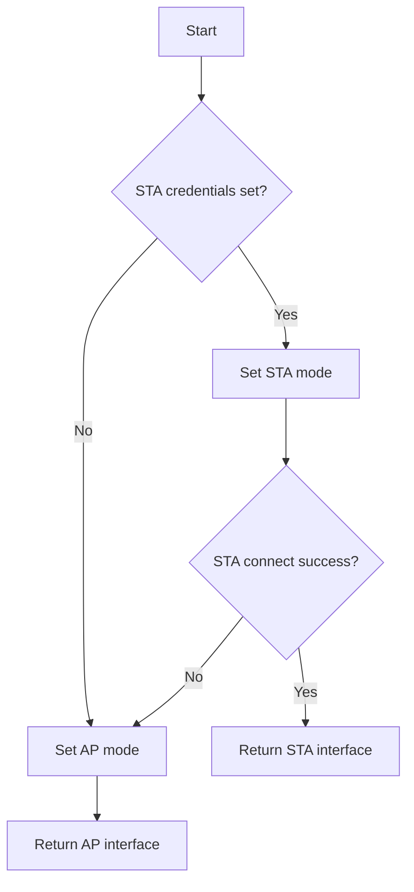

# MicroPython Package - `networkutils`

> [!NOTE]
> The main repo is @ [GitLab](https://gitlab.com/micropython-iot-projects/libraries/micropython-networkutils) and is mirrored @ [GitHub](https://github.com/andyrids/micropython-networkutils).

This is a repository for the `networkutils` MicroPython package, which contains utility functions related to the [`network`](https://docs.micropython.org/en/latest/library/network.html#module-network) standard library and external packages @ [`micropython-lib`](https://github.com/micropython/micropython-lib).

1. Uses network environment variable class for credential configuration in client (STA) & access point (AP) modes.
2. Attempts WiFi connection in STA mode; if unsuccessful, resets interface to AP with default or environment-provided credentials.
3. Provides helper functions for activating, deactivating, connecting interfaces and checking connection status.
4. Implements timeouts for network operations to handle hardware-specific quirks.



## Repository Layout

This repo is setup to be a Python [namespace](https://packaging.python.org/en/latest/guides/packaging-namespace-packages/) package in local development and a in a MicroPython context, this package follows the ***extension package*** concept outlined in the [micropython-lib](https://github.com/micropython/micropython-lib) repository. This enables unit & integration tests with pytest, matching the interface exposed on the device. See [CONTRIBUTING](./CONTRIBUTING.md) for more details.

```text
micropython-networkutils

├── networkutils           <-- Core `networkutils` package
│   ├── networkutils       <-- Device installation dir i.e. `lib/networkutils/`
│   │   └── core.py        <-- Core package module
│   └── package.json       <-- Package URLs & dependencies (for `mip install`)
├── networkutils-mqtt      <-- Extension package for `networkutils`
│   ├── networkutils       <-- Device installation dir i.e. `lib/networkutils/`
│   │   └── mqtt.py        <-- Extension package module
│   ├── package.json       <-- Extension package URLs & dependencies (includes core `networkutils`)
│   └── pyproject.toml     <-- Extension package `pyproject.toml` enables uv workspace & namespace package
│
├── scripts                <-- Project scripts
│   ├── build
│   │   ├── compile.py     <-- Hatch build hook for compilation with `mpy-cross` (WIP)
│   │   └── __init__.py
│   └── __init__.py
│
├── tests                  <-- Pytest Unit & integration tests
│   ├── conftest.py        <-- Pytest fixtures
│   ├── __init__.py
│   ├── integration
│   │   ├── __init__.py
│   │   └── test_connection_and_package.py
│   └── unit
│       ├── __init__.py
│       ├── test_network_config.py
│       ├── test_network_interface_complete.py
│       └── test_network_interface_complex.py
│
├── pyproject.toml         <-- Root `pyproject.toml` enables namespace package setup/installation
└── CHANGELOG.md           <-- Notable changes to this project
└── CONTRIBUTION.md        <-- Local development & contribution guidance
└── TESTING.md             <-- Unit & integration testing guidance
```

## Cloning The Repository

This repository is managed by Astral [`uv`](https://docs.astral.sh/uv/) Python package manager and can be installed by cloning the repository and syncing with uv.

```sh
git clone git@gitlab.com:micropython-iot-projects/libraries/micropython-networkutils.git
cd micropython-networkutils
uv sync --all-extras
```

To install only the core `networkutils` package use:

```sh
uv sync
```

To install a specific extension package (`[project.optional-dependencies]`) such as `networkutils-mqtt` use:

```sh
uv sync --extra mqtt
```

> [!IMPORTANT]
> The `--all-extras` option for the `uv sync` command enables extension package installation and will be necessary for any unit tests or local development that needs them.

## MicroPython Package Installation

The following commands will install the `networkutils` package based on the URLs and dependencies listed in the `networkutils/package.json`.

As we have repositories within sub-groups (on GitLab), the usual installation URLs such as `gitlab:org/repo-name@main` or `gitlab:org/repo-name/dir/__init__.py` will not work. The `mip` package installer always assumes that the first URL component is the org and the second is the repository slug, resulting incorrect parsed URLs for package download/installation. This issue is mitigated by using raw URLs in the `package.json` files and you can also use the GitHub mirror repo i.e. github:andyrids/micropython-network-utils/networkutils/.

You can format and reset your device with `mpremote` using the following command:

```sh
mpremote exec --no-follow "import os, machine, rp2; os.umount('/'); bdev = rp2.Flash(); os.VfsLfs2.mkfs(bdev, progsize=256); vfs = os.VfsLfs2(bdev, progsize=256); os.mount(vfs, '/'); machine.reset()"
```

### `mpremote`

The following commands will install `networkutils` on your device using the `mpremote` Python package. Note that the `package.json` is optional as `mip` will add it, if the URL ends without a `.mpy`, `.py` or `.json` extension.

Using GitLab repo:

```sh
mpremote mip install https://gitlab.com/micropython-iot-projects/libraries/micropython-networkutils/-/raw/HEAD/networkutils
```

Using GitHub repo:

```sh
mpremote mip install github:andyrids/micropython-networkutils/networkutils
```

### REPL

The following code will import `mip` and install the `network-utils` package from the REPL, provided you have a connected and network-capable board.

Using GitLab repo:

```python
>>> import mip
>>> mip.install("https://gitlab.com/micropython-iot-projects/libraries/micropython-networkutils/-/raw/HEAD/networkutils/package.json")
```

Using GitHub repo:

```python
>>> import mip
>>> mip.install("github:andyrids/micropython-networkutils/networkutils/")
```

## Example Usage

Environment variables relevant to network configuration, can be set and retrieved using the `networkutils.NetworkEnv` singleton class.

Environment variables:

* `WLAN_SSID` - Network SSID (STA mode)
* `WLAN_PASSWORD` - Network password (STA mode)
* `AP_SSID` - Your device network SSID (AP mode)
* `AP_PASSWORD` - Your device network password (AP mode)

```python
from networkutils.core import (
    NetworkEnv, access_point_reset, connection_issue, get_network_interface, _logger
)

env = NetworkEnv()
env.putenv("WLAN_SSID", "<YOUR_SSID>")
env.putenv("WLAN_PASSWORD", "<YOUR_PASSWORD>")

# set `debug` parameter to `True` for verbose debug messages
WLAN, WLAN_MODE = get_network_interface(debug=True)

if not connection_issue(WLAN, WLAN_MODE):
    _logger.debug("STA CONNECTION ESTABLISHED")
else:
    _logger.error("CONNECTION ERROR - USING AP MODE")
```

If successfully connected to a WiFi in STA mode, you should see output like the following:

```sh
DEBUG:networkutils:INITIALISE NETWORK WLAN INSTANCE
DEBUG:networkutils:SETTING WLAN MODE TO STA
DEBUG:networkutils:ACTIVATE NETWORK INTERFACE
DEBUG:networkutils:NETWORK INTERFACE ACTIVE - AP MODE
DEBUG:networkutils:CONNECTING TO SSID 'S23'
DEBUG:networkutils:WAITING FOR WLAN CONNECTION
DEBUG:networkutils:WLAN STATUS: 1
DEBUG:networkutils:WLAN STATUS: 1
DEBUG:networkutils:WLAN STATUS: 1
DEBUG:networkutils:WLAN STATUS: 2
DEBUG:networkutils:WLAN STATUS: 2
DEBUG:networkutils:WLAN STATUS: 3
DEBUG:networkutils:WLAN CONNECTION SUCCESSFUL: S23
DEBUG:networkutils:STA CONNECTION ESTABLISHED
```

If there was a connection error or if no configuration variables were set, the device should start in AP mode with output like the following:

```sh
DEBUG:networkutils:INITIALISE NETWORK WLAN INSTANCE
DEBUG:networkutils:INVALID SSID (None) SETTING AP MODE
DEBUG:networkutils:ACTIVATE NETWORK INTERFACE
DEBUG:networkutils:NETWORK INTERFACE ACTIVE - AP MODE
```

You should see your device AP SSID listed as something like `DEVICE-E66164084373532B` in your available networks on your PC or mobile.
