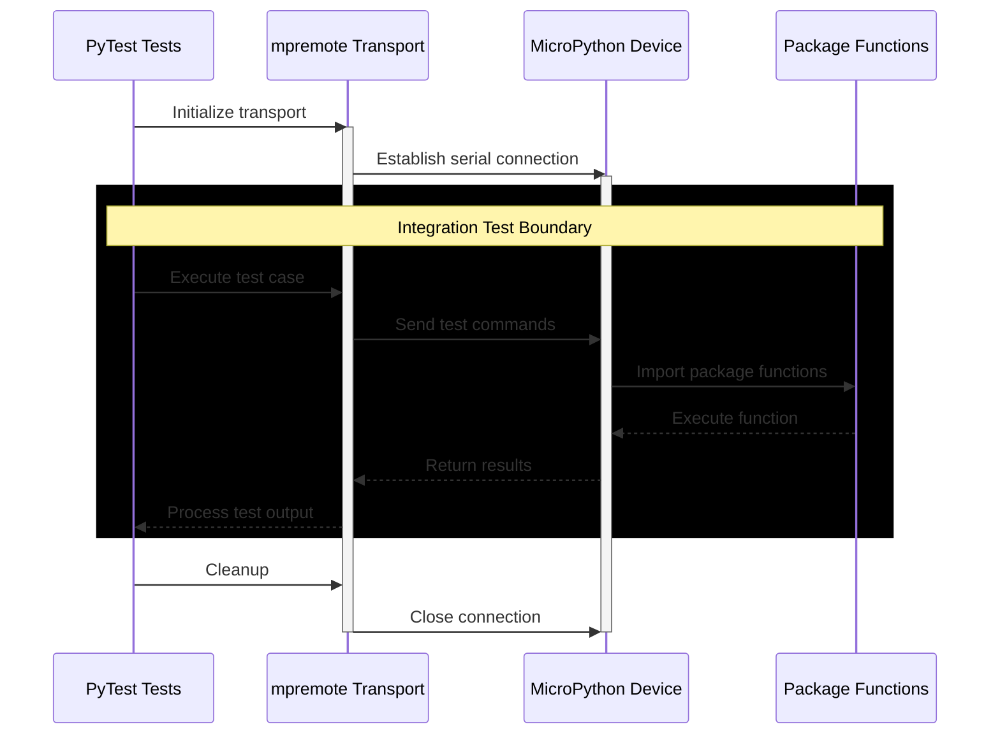

# Testing

Testing instructions and guidance are listed here. All unit tests are written using the MicroPython version of [`unittest`](https://github.com/micropython/micropython-lib/tree/master/python-stdlib/unittest).



## Cloning The Repository

This repository is managed by Astral [`uv`](https://docs.astral.sh/uv/) Python package manager and can be installed by cloning the repository and syncing with uv.

```sh
git clone git@gitlab.com:micropython-iot-projects/libraries/micropython-network-utils.git
cd micropython-network-utils
uv sync
```

## Activate Virtual Environment

Activate the virtual environment to make use of `mpremote`.

```sh
. .venv/bin/activate
```

## Running Unit Tests

Test files are found within each package & extension Package root directory, e.g. `/network-utils/test_utils.py`. The relevant package or extension package should be installed on the device:

```sh
mpremote mip install network-utils/package.json
```

We also need to install the MicroPython `unittest` package:

```sh
mpremote mip install unittest
```

With dependencies installed, run the relevant test file on the device:

```sh
mpremote run network-utils/test_utils.py
```

You should see output like below:

```sh
test_system_micropython (__main__.TestNetworkUtils) ... ok
test_networkenv_singleton (__main__.TestNetworkUtils) ... ok
test_networkenv_getenv_putenv (__main__.TestNetworkUtils) ... ok
test_connection_issue_sta (__main__.TestNetworkUtils) ... ok
test_connection_issue_ap (__main__.TestNetworkUtils) ... ok
----------------------------------------------------------------------
```
