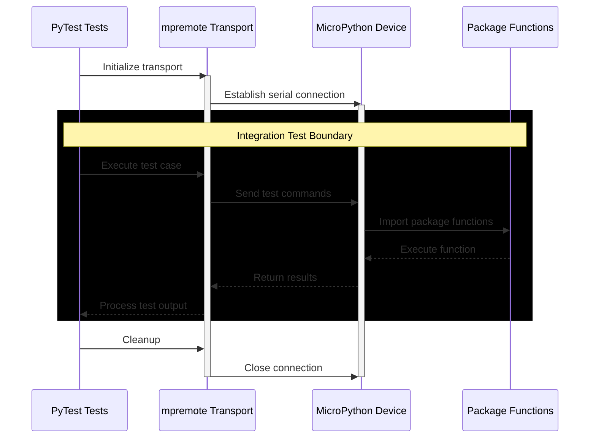

# Testing

Testing instructions and guidance are listed here. All unit tests are written using the MicroPython version of [`unittest`](https://github.com/micropython/micropython-lib/tree/master/python-stdlib/unittest).



## Cloning The Repository

This repository is managed by Astral [`uv`](https://docs.astral.sh/uv/) Python package manager and can be installed by cloning the repository and syncing with uv.

```sh
git clone git@gitlab.com:micropython-iot-projects/libraries/micropython-network-utils.git
cd micropython-network-utils
uv sync
```

## Activate Virtual Environment

Activate the virtual environment:

```sh
. .venv/bin/activate
```

## Running Unit Tests

Unit test files are found within `tests/unit` directory. These tests can be run with `pytest`, with the following command:

```sh
python -m pytest
```
