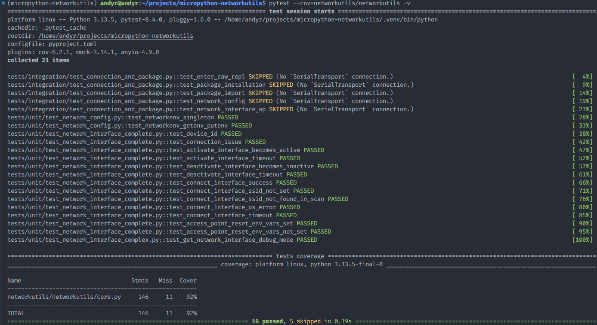
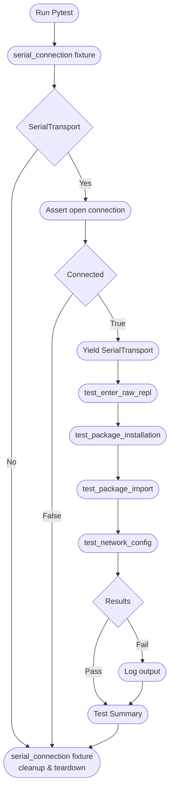

# Testing

Testing instructions and guidance are listed here. All unit tests are written using the [pytest](https://docs.pytest.org/en/stable/index.html) library.

## Cloning The Repository

This repository is managed by Astral [`uv`](https://docs.astral.sh/uv/) Python package manager and can be installed by cloning the repository and syncing with uv.

```sh
git clone git@gitlab.com:micropython-iot-projects/libraries/micropython-networkutils.git
cd micropython-networkutils
uv sync --all-extras
```

## Activate Virtual Environment

Activate the virtual environment:

```sh
. .venv/bin/activate
```

## Test Layout

```text
...
├── tests                                      <-- Main test directory
│   ├── integration                            <-- Integration tests
│   │   ├── __init__.py
│   │   └── test_connection_and_package.py     <-- WIP for integration tests
│   ├── unit                                   <-- Unit tests
│   │   ├── __init__.py
│   │   ├── test_network_config.py             <-- Network configuration tests
│   │   ├── test_network_interface_complete.py <-- Complete interface tests
│   │   └── test_network_interface_complex.py  <-- Complex interface unit tests
│   ├── __init__.py
│   └── conftest.py                            <-- Fixtures & mocks for MicroPython modules
```

## Unit Testing

The unit test functions can be run with the following command:

```sh
pytest --cov=networkutils -v
```

## Integration Testing

> [!IMPORTANT]
> Integration tests (`tests/integration`) are a WIP.

Having experimented with `mpremote`, I have found a way to install the `networkutils` package and connect to a microcontroller in a script context, rather than through the CLI. Through a programmatic connection to the REPL, it is possible to send commands that utilise and test the package on the device, returning any output as a string for assertions within pytest functions.

A `serial_connection` fixture with 'module' scope ensures all tests use the same `SerialTransport` instance, which is used to send commands over the raw REPL. If the fixture raises an exception or all tests have skipped/failed/completed, cleanup and teardown of the connection is carried out by the fixture.

> [!NOTE]
> Integration tests will skip, if a device is not connected or if the serial connection failed.



### Integration Testing Flow


